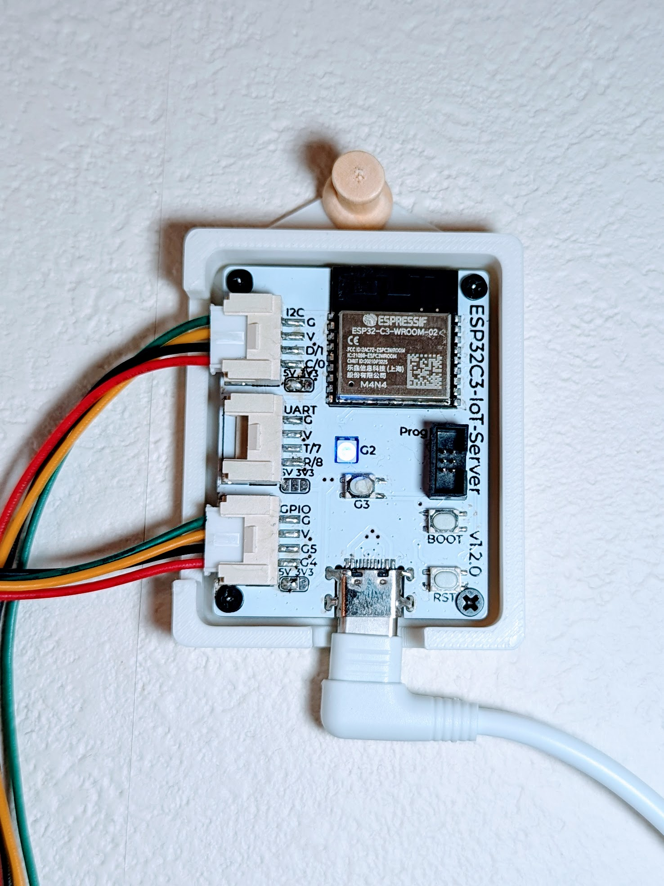
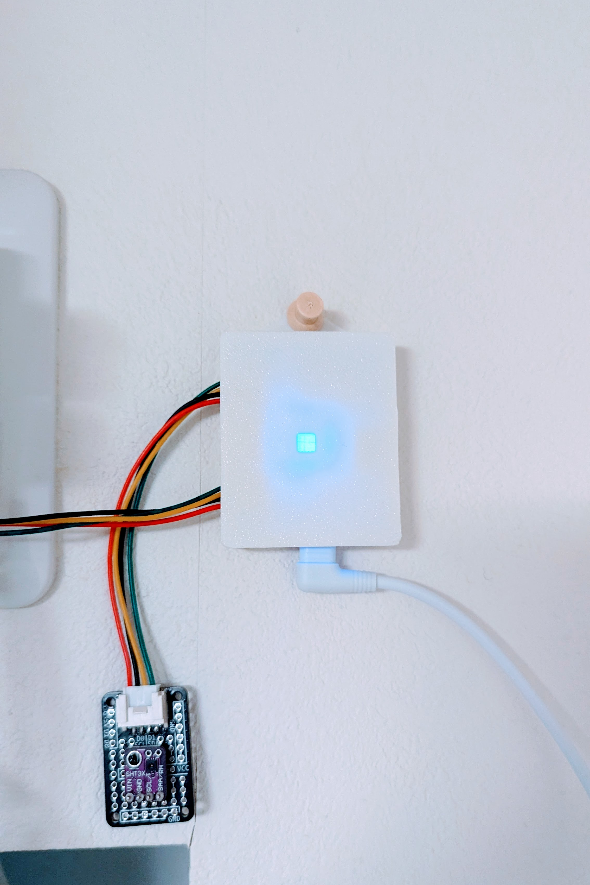
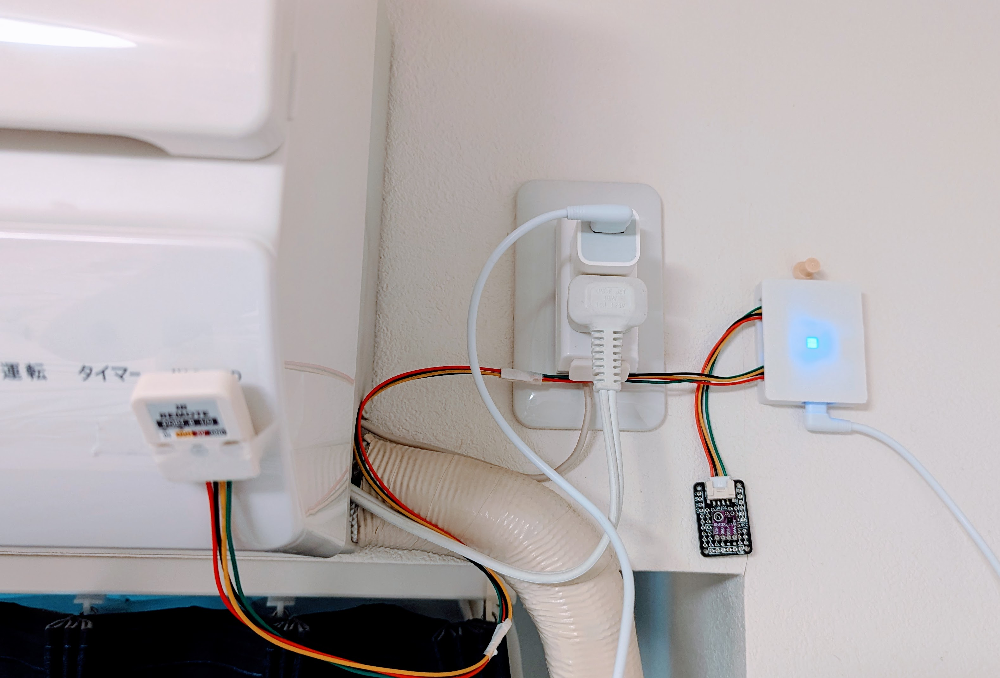

# IoT Client Board - ESP32C3

## v1.2.0

- Semantics: [PDF](./pcb-kicad/esp32c3-iot-server-v1.2.0-semantics.pdf) [kicanvas](https://kicanvas.org/?github=https%3A%2F%2Fgithub.com%2F74th%2Fesp32c3-iot-client-board%2Fblob%2Fv1.2.0%2Fpcb-kicad%2Fesp32c3-iot-client-board.kicad_sch)
- PCB [kicanvas](https://kicanvas.org/?github=https%3A%2F%2Fgithub.com%2F74th%2Fesp32c3-iot-client-board%2Fblob%2Fv1.2.0%2Fpcb-kicad%2Fesp32c3-iot-client-board.kicad_pcb)

### BOM

| Reference   | Name                                     | Quantity |
| ----------- | ---------------------------------------- | -------- |
| C1          | Capacitor 0805 1uF                       | 1        |
| C2, C4      | Capacitor 0805 100nF                     | 2        |
| C3, C5-C8   | Capacitor 0805 10uF                      | 5        |
| CH1         | HY2.0 Socket SMD 4Pin - I2C              | 1        |
| CH2         | HY2.0 Socket SMD 4Pin - UART             | 1        |
| CH3         | HY2.0 Socket SMD 4Pin - GPIO             | 1        |
| D1          | RGBLED 3528 SK6812MINI-E                 | 1        |
| J1          | Box Pin Header 2x3 Pitch 1.27mm          | 1        |
| J2          | USB Type-C Receptacle - USB2.0_C_v3      | 1        |
| R1, R2      | Capacitor 0805 1kΩ (NC)                  | 2        |
| R3, R4, R10 | Capacitor 0805 10kΩ                      | 3        |
| R5, R9      | Capacitor 0805 5.1kΩ                     | 2        |
| R6, R7      | Capacitor 0805 10Ω                       | 2        |
| R8          | Capacitor 0805 56kΩ                      | 1        |
| SW1         | Button SKRPABE010                        | 1        |
| SW2         | Button SKRPABE010                        | 1        |
| SW3         | Button SKRPABE010                        | 1        |
| U1          | WiFi MCU Module ESP32-C3-WROOM-02        | 1        |
| U2          | Regulator 3.3V SOT-223 AMS1117-3.3       | 1        |
| U3          | USB Power Protection IC SOT-23-6L CH217K | 1        |

## v1.1.1

### BOM

| Reference     | Name                                  | Quantity |
| ------------- | ------------------------------------- | -------- |
| C1            | Capacitor 0805 1uF                    | 1        |
| C2, C3        | Capacitor 0805 100nF                  | 2        |
| C4, C5        | Capacitor 0805 10uF                   | 2        |
| CH1           | HY2.0 Socket SMD 4Pin - I2C           | 1        |
| CH2           | HY2.0 Socket SMD 4Pin - UART          | 1        |
| CH3           | HY2.0 Socket SMD 4Pin - GPIO          | 1        |
| D1            | RGBLED 3528 SK6812MINI-E              | 1        |
| F1            | PolyFuse 1812 KT6-1100SMDI (NC)       | 1        |
| J1            | Box Pin Header 2x3 Pitch 1.27mm       | 1        |
| J2            | USB Type-C Receptacle - USB2.0_C_v3   | 1        |
| R1, R2, R5-R7 | Capacitor 0805 10kF                   | 5        |
| R3, R4        | Capacitor 0805 5.1kF                  | 2        |
| R8            | Capacitor 0805 42kF                   | 1        |
| SW1           | Button SKRPABE010                     | 1        |
| SW2           | Button SKRPABE010                     | 1        |
| SW3           | Button SKRPABE010                     | 1        |
| U1            | WiFi MCU Module ESP32-C3-WROOM-02     | 1        |
| U2            | Regulator 3.3V SOT-223 AMS1117-3.3    | 1        |
| U4            | USB Power Protection IC SOT-26 CH214K | 1        |
